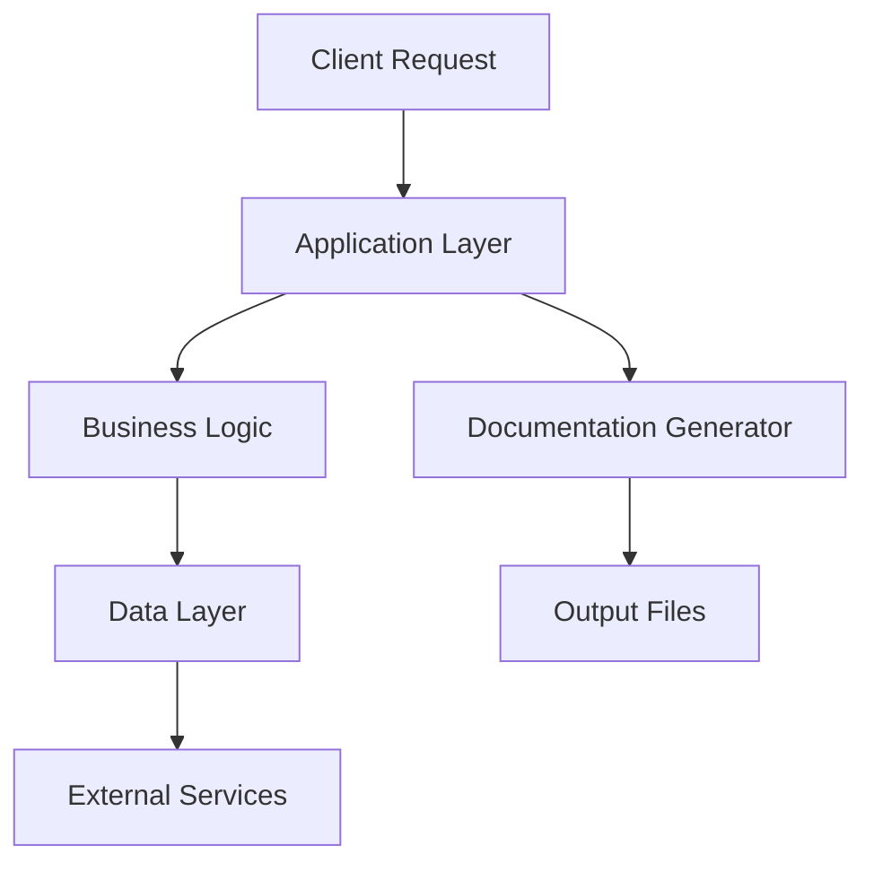

# Project Overview

## 1. System Overview
This repository was analyzed by Gavlix Docs to produce a comprehensive engineering overview. The system contains 0 files, 0 classes, and 0 functions. Documentation is generated from repository structure, dependencies, and inferred workflows.

## 2. Architecture Overview

The architecture follows a layered approach with clear separation of concerns. The documentation generator analyzes the codebase structure and produces comprehensive documentation.

## 3. Module Breakdown
| Module | Purpose | Responsibilities | Dependencies | Key Classes | Key Functions |
|--------|---------|------------------|--------------|-------------|---------------|
| No modules detected | - | - | - | - | - |

## 4. End-to-End Workflows
UNKNOWN: No workflows detected in codebase

## 5. Database Architecture
UNKNOWN: No database tables detected in codebase

## 6. API Overview
UNKNOWN: No API routes detected in codebase

## 7. Security Overview
Authentication:
- UNKNOWN: Authentication method not detected in codebase

Authorization:
- UNKNOWN: Authorization logic not detected in codebase

Token/Session Handling:
- UNKNOWN: Token/session handling not detected in codebase

Security Considerations:
- Input validation should be implemented on all user inputs
- Sensitive data should be encrypted at rest and in transit
- Dependencies should be regularly updated for security patches

## 8. Deployment Overview
Deployment Configuration:
- UNKNOWN: No deployment configuration detected in codebase

Environment Variables:
- UNKNOWN: Environment variables not derivable from code

Runtime:
- UNKNOWN: Runtime configuration not derivable from code

## 9. Diagrams
- [Architecture Diagram](diagrams/architecture.mmd)
- [Dependency Graph](diagrams/dependency.mmd)
- [Workflow Diagram](diagrams/workflows.mmd)
- [Database Schema](diagrams/database.mmd)

## 10. Documentation Structure
- `README.md` - This file
- `docs/` - Detailed documentation
  - `architecture.md` - System architecture details
  - `database.md` - Database schema and relationships
  - `security.md` - Security considerations
  - `deployment.md` - Deployment configuration
  - `api.md` - API documentation
  - `workflows.md` - Workflow descriptions
  - `adr/` - Architecture Decision Records
- `diagrams/` - Mermaid diagram source files
- `modules/` - Module-specific documentation
